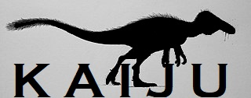

# CERT Kaiju

CERT Kaiju is a collection of binary analysis tools for
[Ghidra](https://ghidra-sre.org).

This is a Ghidra/Java implementation of some features
of the [CERT Pharos Binary Analysis Framework][pharos], 
particularly the function hashing and malware analysis tools,
but is expected to grow new tools and capabilities over time.

## Tool Overview

The following capabilities are currently released in CERT Kaiju:

- [GhiHorn](./GhiHorn.html)
- [Function Hashing and Similiarity, including Fn2Hash and Fn2Yara](./FnHashing.html)
- [OOAnalyzer Importer tool](./OOAnalyzerImporter.html)
- [Disassembly Improvements analyzer](./DisAsmImprovements.html)

Many tools can also be [run in headless mode](./HeadlessKaiju.html).

## Release Notes

As this is a new effort, this implementation does not yet have full
feature parity with the original C++ implementation based on ROSE;
however, the move to Java and Ghidra has actually enabled some new
features not available in the original framework -- notably, improved
handling of non-x86 architectures. Since some significant
re-architecting of the framework and tools is taking place, and the
move to Java and Ghidra enables different capabilities than the C++
implementation, the decision was made to utilize new branding
such that there would be less confusion between implementations
when discussing the different tools and capabilities.

Our intention for the near future is to maintain both the
original Pharos framework as well as Kaiju, side-by-side,
since both can provide unique features and capabilities.

CAVEAT: As a prototype, there are many issues that may come up when
evaluating the function hashes created by this plugin. For example,
unlike the Pharos implementation, Kaiju's function hashing module will
create hashes for very small functions (e.g., ones with a single
instruction like RET causing many more unintended collisions). As
such, analytical results may vary between this plugin and Pharos
fn2hash.

## Licensing
    
CERT Kaiju is released as open source software under terms of an
BSD-like license. See the full [License](./license.htm) for details.

The CERT Kaiju logo is based on [art][logo] created by Cameron Spahn,
originally released under terms of
[Creative Commons Attribution-Share Alike 4.0 International license][logo-license].

[pharos]: https://github.com/cmu-sei/pharos
[logo]: https://commons.wikimedia.org/wiki/File:RapatorCameronSpahn.jpg
[logo-license]: https://creativecommons.org/licenses/by-sa/4.0/
